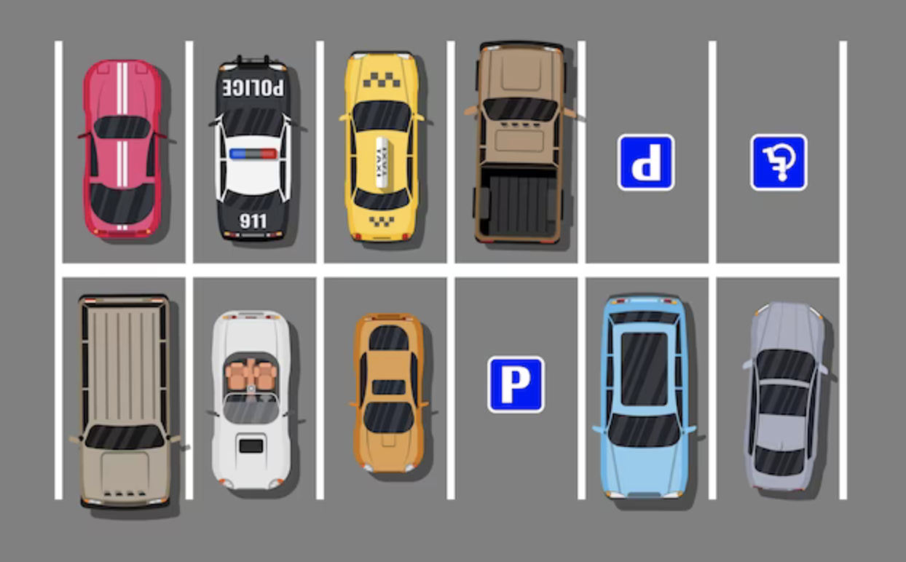

# Parspot (Parking spot)
## Overview
**Parspot** - is a parking lot management system that allows users to manage their parking lots and parking spots.

## Features
- [ ] Create parking lot
- [ ] Create parking spot
- [ ] Create parking spot type
- [ ] Create parking spot status
- [ ] Create parking spot price
- [ ] Create parking spot price history
- [ ] Create parking spot reservation
- [ ] Create parking spot reservation history
- [ ] Create parking spot payment
- [ ] Create parking spot payment history

---

- [ ] Update parking lot
- [ ] Update parking spot
- [ ] Update parking spot type
- [ ] Update parking spot status
- [ ] Update parking spot price
- [ ] Update parking spot price history
- [ ] Update parking spot reservation
- [ ] Update parking spot reservation history
- [ ] Update parking spot payment
- [ ] Update parking spot payment history